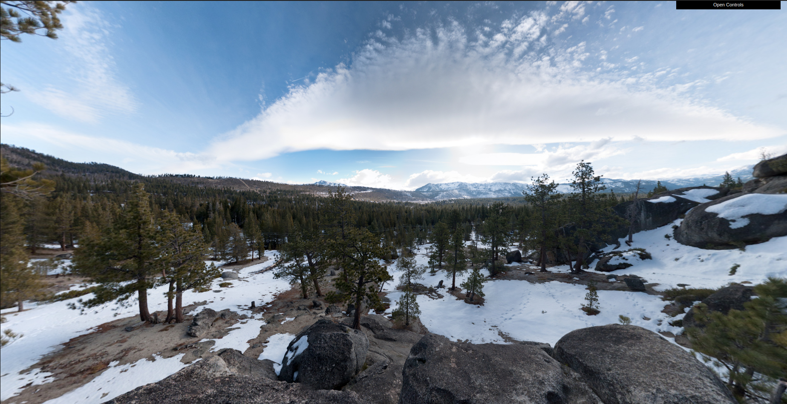
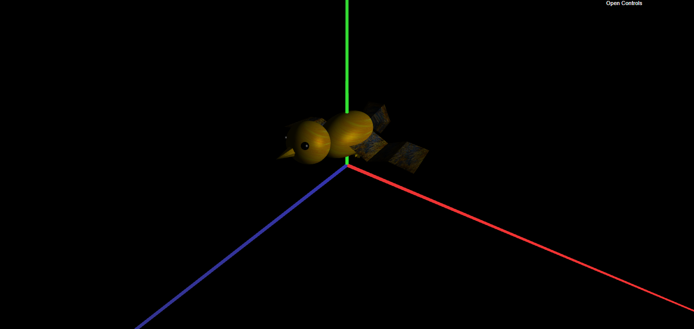
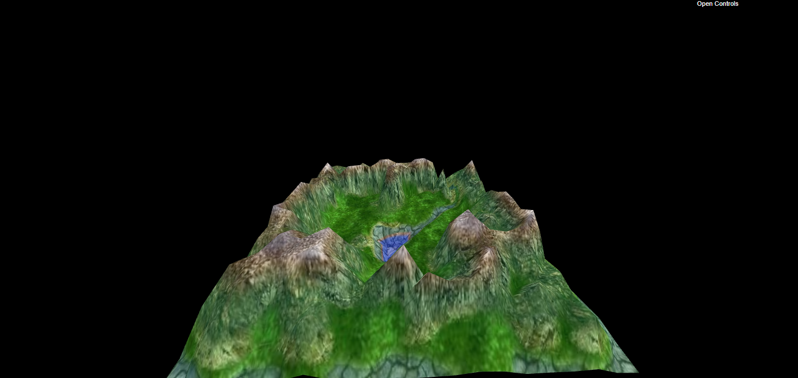
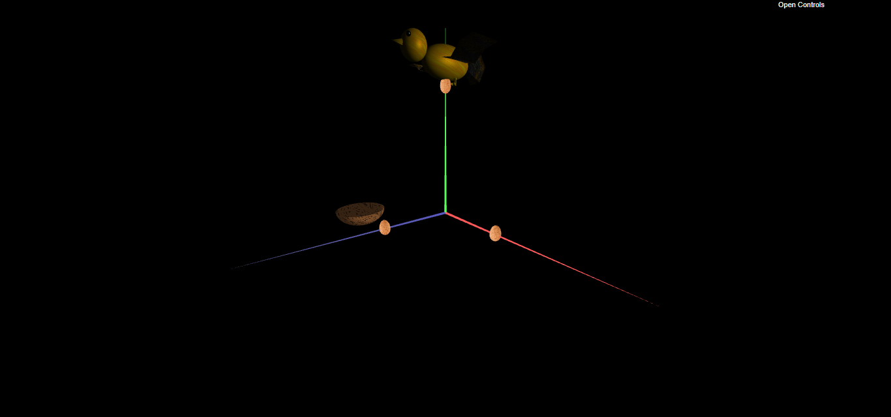
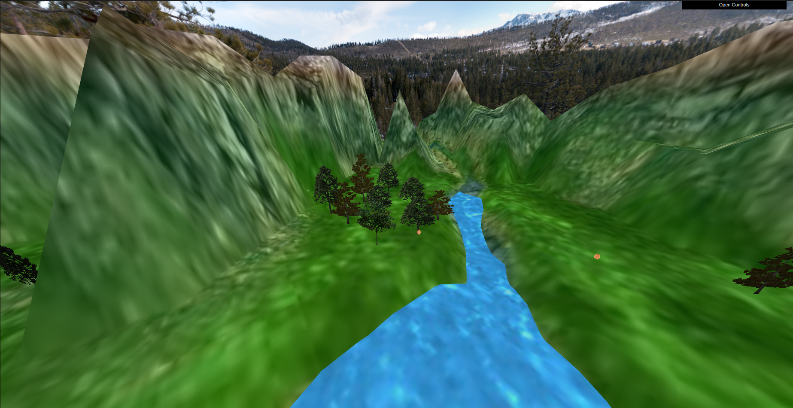
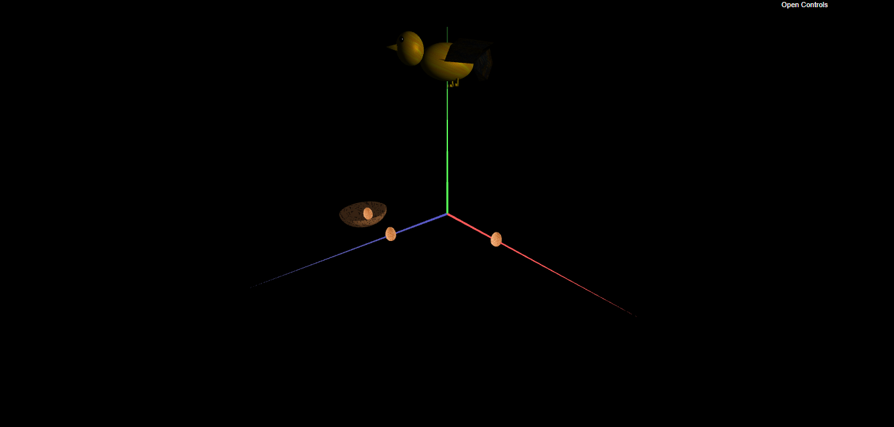

# CG Project 2022/2023

## Group T01G04
| Name             | Number    | E-Mail             |
| ---------------- | --------- | ------------------ |
| Diogo Babo         | 202004950 | up202004950@edu.fe.up.pt                |
| João Oliveira       | 202004407 | up202004407@edu.fe.up.pt                |

## Observations
All required features were developed. The additional development chosen was the parabolic trajectory for the egg when it is dropped by the bird.

## Screenshots

Here we can see the panorama. We decided to use a different texture for the panorama. [Credits](https://www.flickr.com/photos/onecm/6867917907/in/photolist-bsTSHH-QUdT8i-XtPTb5-4dJZrn-RPPQDc-4Rd7Mg-yPyTvs-WU5ANQ-KUn1j6-QEMFgG-243ehnD-oihhPF-hbgSNF-GHXTiE-24MdbYT-2f1idGL-28CsugU-22GSzy5-HaijVp-CNyunG-KjTk1m-95HMPB-K7RnjK-PmYzDd-2frBCJh-KnnrNG-xUg53q-cnGRbY-Li1tf2-292Yqsq-LkWZFS-HcNoEf-2b5XwhQ-DUtnk-F5kRXw-P7TxHU-JbxSwS-2cJmyXv-26ByHMV-2347gcy-4tv6C2-nGiDnf-27Z1pVW-25SQfFL-4syj9i-28PTMiH-21dd1Ch-NyeDhB-TqUGeU-HLsp5C)

The geometry of our bird is the following: sphere for the body, head & eyes, a pyramid for the beak and for the tail and planes for the wings.

The terrain using the heightmap, altimetry and the respective texture.

Since it's impossible to capture the movement of the bird picking up egg / dropping it using a screenshot, we decided to screenshot the bird with the egg. (It's visible in the video)

In this specific example we can see the use of TreeGroupPatch with the terrain. There is a random offset between the trees as asked to not make it a perfect grid.

Since it's impossible to capture the parabolic movement of the egg, we decided to screenshot the egg in the nest. (It's visible in the video)